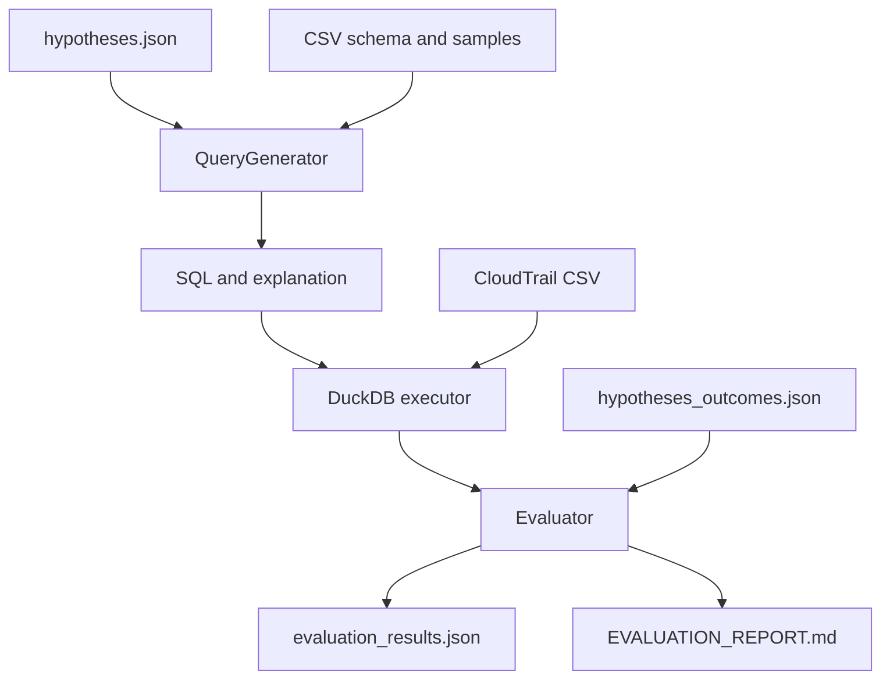

# AI Threat Hunting Query Generation

This project converts natural-language AWS CloudTrail hunting hypotheses into executable DuckDB SQL, explains each query, and evaluates its results against held-out expected outcomes.

## Architecture



Expected outcomes are isolated from query generation and are loaded only for offline scoring.

## Setup and run

```bash
uv sync
```

Put `nineteenFeaturesDf.csv` at `data/nineteenFeaturesDf.csv` from Kaggle (https://www.kaggle.com/datasets/nobukim/aws-cloudtrails-dataset-from-flaws-cloud?resource=download&select=nineteenFeaturesDf.csv), then create `.env`:

```text
GROQ_API_KEY=your_key_here
GROQ_MODEL=openai/gpt-oss-20b
```

Inspect the detected schema without an API call:

```bash
uv run python main.py --inspect
```

Run baseline and improved evaluations:

```bash
uv run python main.py
uv run pytest -q
```

The run writes `evaluation_results.json` and `EVALUATION_REPORT.md`.

## Design decisions

### Choice of interface
DuckDB queries the 1 GB CSV without loading it fully into application memory and supports SQL execution, inspection, and filtering and aggregation directly. And finally, one retry repairs execution errors if any.

### Prompting decision
The old_prompt file in the prompts folder shows the LLM is injected with a prompt where it has to make grouping decisions on the basis of hypotheses which can affect the quality of the SQL query generated. So the new system_prompt has explicit guardrail on providing only select statements without any group by and the LLM response parser function ensures it.

### Evaluation framework
The result is evaluated on 2 basis:
1. Event level result : Compared as is to the expected outcome
2. Group level result : Ensured by grouping columns of the hypotheses where the expected outcome has a count, to compare it to our actual outcome/result.


## Extending to another dataset

Change the CSV path and table name in `main.py`. Schema and samples are discovered at runtime. Update the few-shot examples so they match the new dataset's domain and columns.
