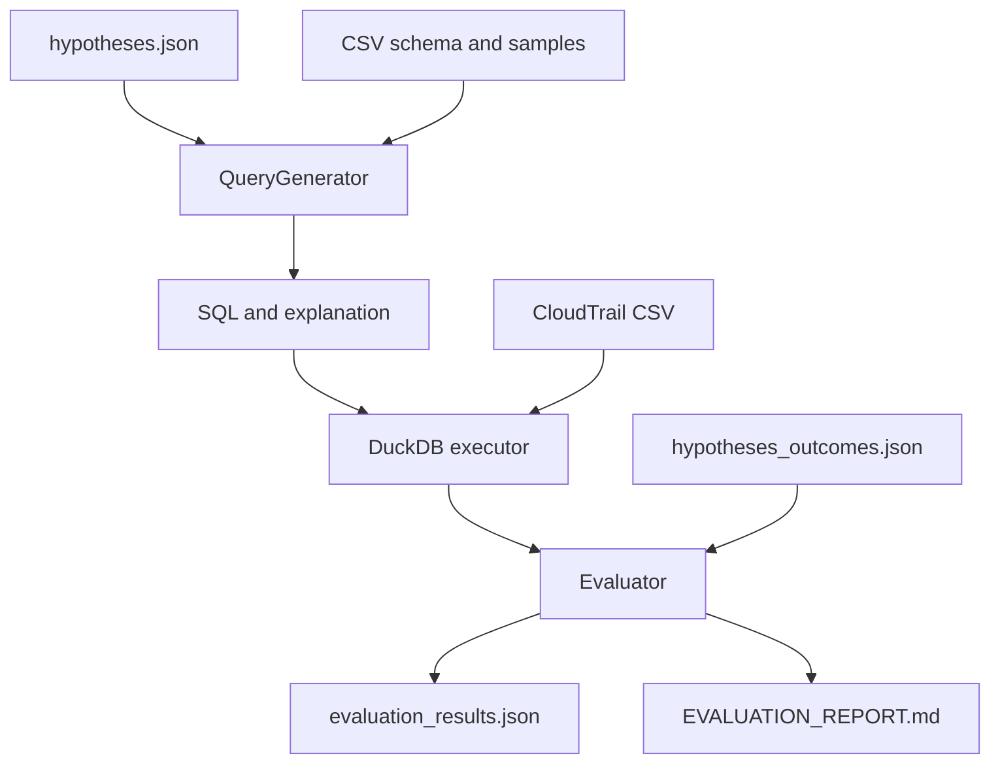

# AI Threat Hunting Query Generation

This project converts natural-language AWS CloudTrail hunting hypotheses into executable DuckDB SQL, explains each query, and evaluates its results against held-out expected outcomes.

## Architecture



Expected outcomes are isolated from query generation and are loaded only for offline scoring.

## Setup and run

```bash
uv sync
```

Put `nineteenFeaturesDf.csv` at `data/nineteenFeaturesDf.csv` from Kaggle (https://www.kaggle.com/datasets/nobukim/aws-cloudtrails-dataset-from-flaws-cloud?resource=download&select=nineteenFeaturesDf.csv), then create `.env`:

```text
GROQ_API_KEY=your_key_here
GROQ_MODEL=openai/gpt-oss-120b
```

Inspect the detected schema without an API call:

```bash
uv run python main.py --inspect
```

Generate and view explanations for all hypotheses without executing or scoring:

```bash
uv run python main.py --generate-only
```

Run baseline and improved evaluations:

```bash
uv run python main.py
uv run pytest -q
```

The run writes `evaluation_results.json` and `EVALUATION_REPORT.md`.

## Design decisions

### Choice of interface
DuckDB queries the CSV without loading it fully into application memory and supports SQL execution, inspection, filtering, and aggregation directly. One retry repairs execution errors when they occur.

### Prompting decision
An earlier prompt let the model decide whether an answer needed grouping and by which columns, which caused it to under-group relative to the reference outcomes. The current prompt removes that decision entirely: the model always returns raw, filtered rows and is blocked — by prompt instruction and a hard validation check — from writing `GROUP BY` or any aggregate. Grouping is handled downstream by the evaluator instead. See `APPROACH.md` for the full iteration story and failure analysis.

### Evaluation framework
Results are scored on two bases:
1. **Event-level**: expected outcomes with no `count` column are compared row-for-row via precision/recall/F1.
2. **Grouped**: expected outcomes with a `count` column are matched by grouping the actual result on the expected outcome's own columns, then compared for an exact match, with F1 overlap reported for diagnosis on near-misses.

## Extending to another dataset

Change the CSV path and table name in `main.py`. Schema and samples are discovered at runtime. Update the few-shot examples so they match the new dataset's domain and columns. Note: grouped-result matching by `_row_id` (indexing) assumes the CSV's row order stays stable between however the ground truth was generated and however DuckDB reads the file.
